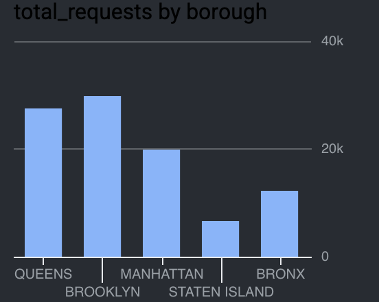
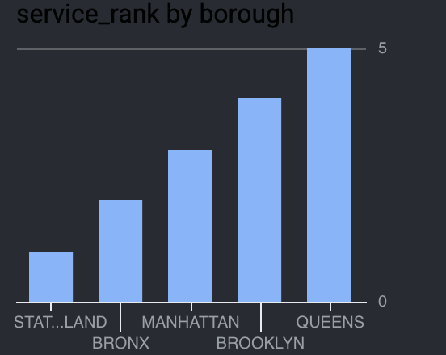

# NYC 311 DEP Service Request Analysis

## Overview

This project analyzes New York City 311 service requests related to the Department of Environmental Protection (DEP) using SQL in Google BigQuery. The goal was to identify complaint patterns, evaluate service performance, and compare operational efficiency across NYC boroughs.

## Tools

* Google BigQuery
* SQL
* Google Cloud Console Visualizations
* GitHub

## Dataset

NYC 311 Service Requests (DEP-related complaints)

Key fields analyzed:

* Complaint Type
* Borough
* Status
* Created Date
* Closed Date

## Analysis

### Complaint Volume by Type

Water System complaints were the most common DEP-related issue, followed by Noise and Sewer complaints. Together, these categories accounted for the majority of service requests.

### Requests by Borough

Brooklyn recorded the highest number of requests (29,910), followed by Queens (27,570) and Manhattan (19,877). Staten Island generated the fewest requests.

### Top Complaint by Borough

| Borough       | Top Complaint |
| ------------- | ------------- |
| Bronx         | Water System  |
| Brooklyn      | Water System  |
| Queens        | Water System  |
| Staten Island | Water System  |
| Manhattan     | Noise         |

Water System issues were the leading complaint in four of the five boroughs, while Noise complaints were the most common issue in Manhattan.

### Resolution Performance

| Borough       | Avg Resolution Days |
| ------------- | ------------------- |
| Queens        | 4.67                |
| Brooklyn      | 4.01                |
| Manhattan     | 3.81                |
| Bronx         | 2.91                |
| Staten Island | 2.56                |

Queens had the longest average resolution time, while Staten Island had the shortest.

### Borough Service Ranking

| Rank | Borough       |
| ---- | ------------- |
| 1    | Staten Island |
| 2    | Bronx         |
| 3    | Manhattan     |
| 4    | Brooklyn      |
| 5    | Queens        |

Ranking was based on average complaint resolution time for closed requests.

### Request Status

94% of all requests were successfully closed, indicating a high overall completion rate.

## SQL Concepts Used

* Aggregations (COUNT, AVG)
* Common Table Expressions (CTEs)
* Window Functions (RANK)
* Date and Time Analysis
* Percentage Calculations
* Performance Metrics

## File

* `nyc_311_dep_analysis.sql`

## Key Takeaway

The analysis shows that Water System issues drive most DEP service activity across NYC, while service performance varies by borough. Staten Island and the Bronx demonstrated the fastest average resolution times, whereas Queens experienced the longest resolution times despite having the second-highest request volume.
